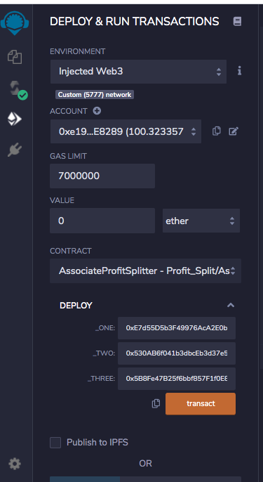
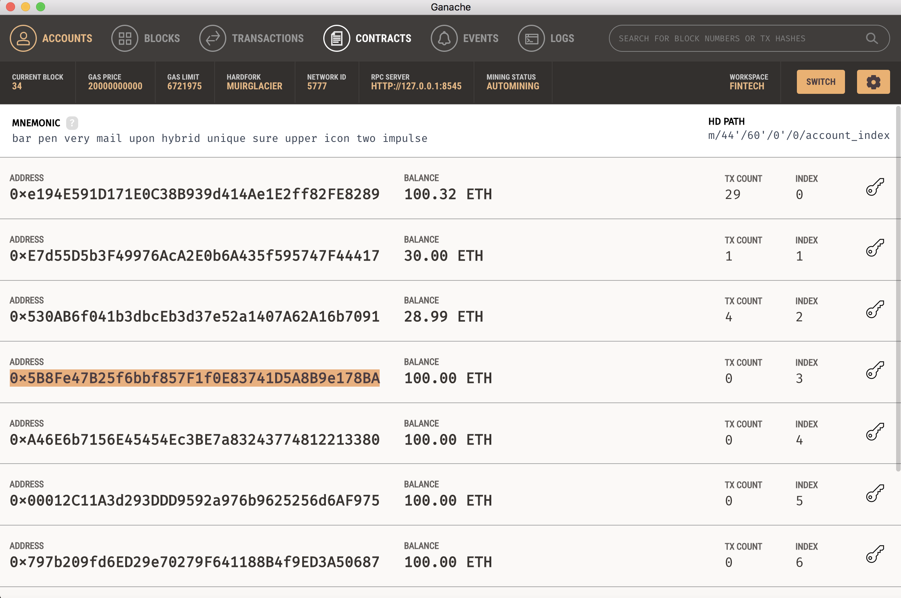
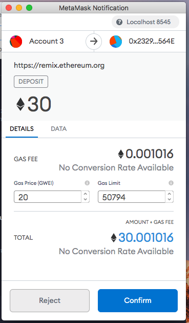
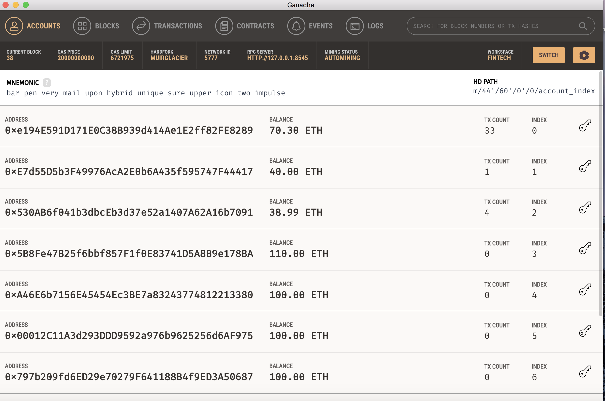
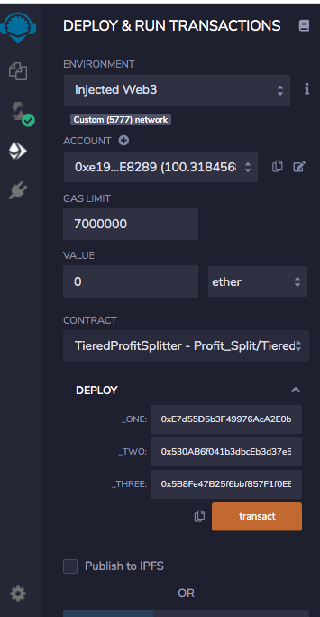
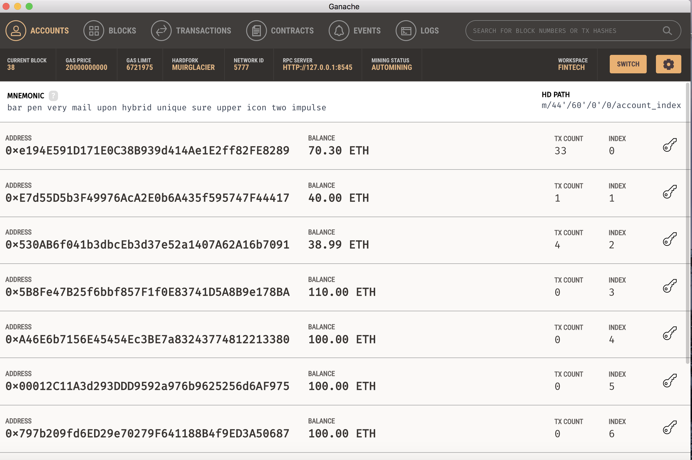
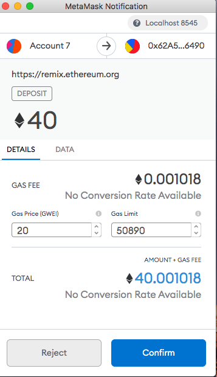
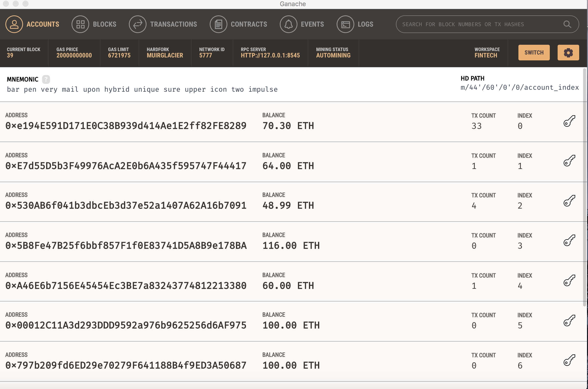
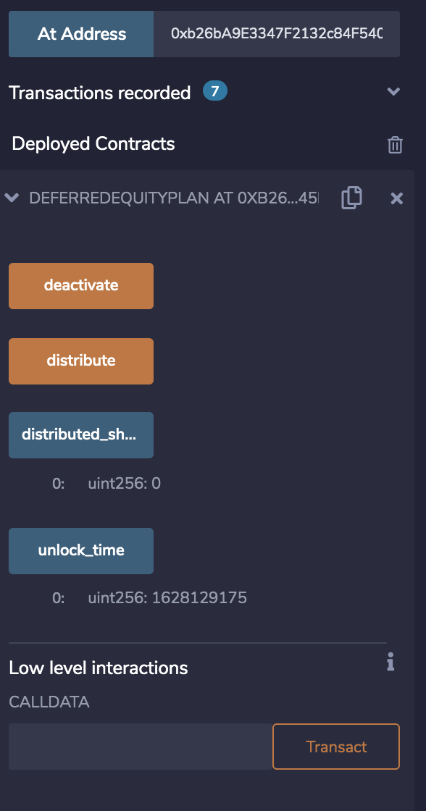

# Profit Splitting with Solidity
For this project I have created three smart contracts with different functionalities to allow companies to pay employees, split profits, and distribute shares.

# Level One: Associate Profit Splitter
The first contract I created is designed to allow a payroll department to send Ether to the contract and have it automatically split and send the amount 3 to rightful employees address.  This contract also sends any Ether that may be left over due to transaction fees and uneven splitting back to the payroll's address.  To complete this contract 3 addresses are to be entered to the contract at deployment.

To demonstrate its functionality I launced the contract on a local network using Ganache and took note of the values of the senders and recievers addresses before sending any Ether to the contract.

After deploying the contract and paying the gas I tested the contract by sending a total of 30 ether to the contract using Metamask.

I then checked my Ganache to observe the changes in the wallet addresses associated with the contract.  It was a success!  Each wallet recieved an equal number of Ether.

# Level Two: Tiered Profit Splitter
The next contract is fundamentally the same but instead of splitting the profit three ways the contract will divide the amount of ether into tiered amounts based on the role of the employee.  In this case 60% will go to the CEO, 25% to the CTO, and 15% to am employee.  To do so each percentage amount is inputted into the contract while keeping a total track of the amount distibuted.
Again the contract is deployed and each wallet address is entered into the deployer to run the contract.

After the contract was deployed I took note of the address balances in Ganache.

Finally 40 ether was sent to the contract from the payroll's address.

Once the transaction was complete I checked the addresses on Ganache.  It was succesful!  Each address received the proper amount of Ether.

# Deferred Equity
 The final contract is slightly different from the others.  For this contract 1000 company shares will be distributed to an employee over a 4 year period.  Also if the employee does not stay with company for the full four years, that employee will deffer any uncollected shares by the employee.  The contract will also be locked for a period of 365 before the shares can be distributed. The contract was deployed and is fully functional.
 
